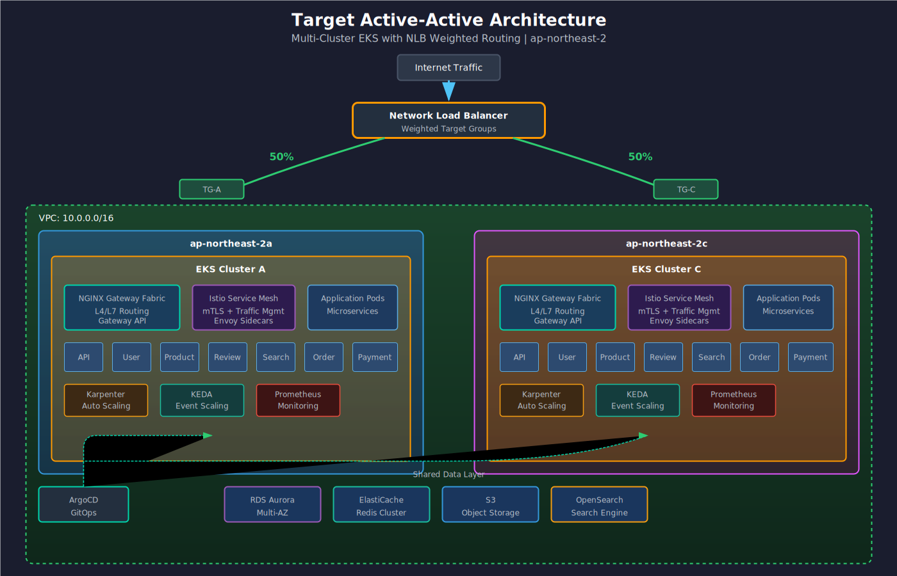
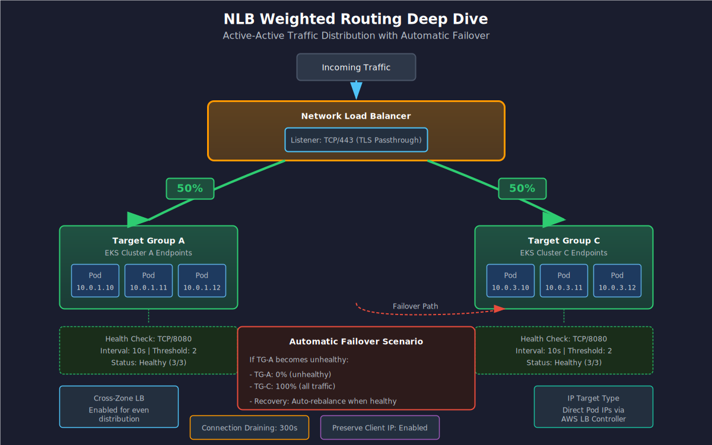
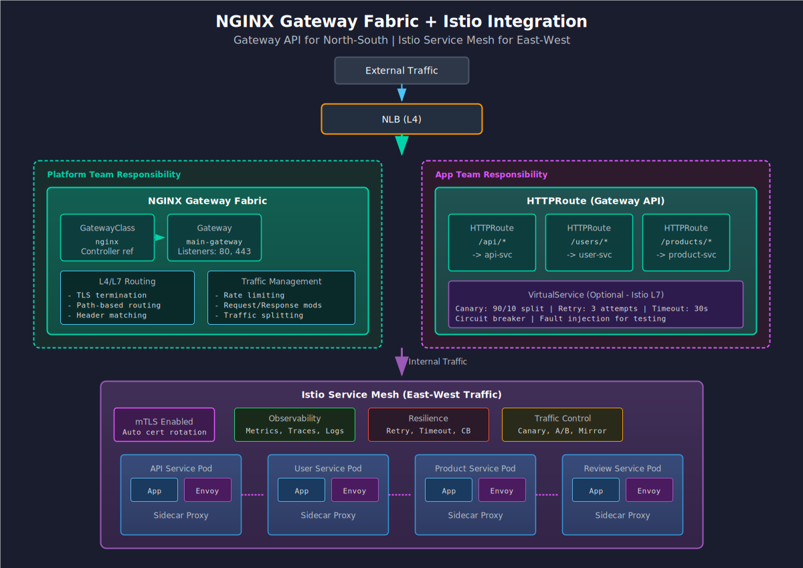

# ECS → EKS Migration Deep Dive
Multi-Cluster Active-Active Architecture (30min)

@type: cover
@background: ../common/pptx-theme/images/Picture_13.png
@badge: ../common/pptx-theme/images/Picture_8.png

@speaker: Junseok Oh
@title: Sr. Solutions Architect, AWS
@company: 화해 글로벌
:::notes
{timing: 1min}
안녕하세요, AWS 솔루션즈 아키텍트 오준석입니다. 오늘은 화해 팀의 ECS에서 EKS로의 마이그레이션 여정 중 첫 번째 세션으로, Multi-Cluster Active-Active 아키텍처에 대해 다루겠습니다. 네트워크 구성의 복잡성과 IP 고갈 문제를 해결하는 방법을 중점적으로 살펴보겠습니다.
:::

---

@type: content

## 고객 Pain Point

> "네트워크 구성이 복잡하고, Security Group과 ENI IP 고갈 문제로 스케일링에 한계가 있습니다."

::: left
### 현재 문제점
- ECS Fargate/EC2 혼합 운영 복잡성
- VPC CIDR 고갈로 신규 서비스 배포 어려움
- Security Group 규칙 관리 부담
- 단일 클러스터 장애 시 전체 서비스 영향
:::

::: right
### 기대 효과
- Multi-Cluster로 Blast Radius 최소화
- Prefix Delegation으로 IP 효율성 4배 향상
- Gateway API로 표준화된 트래픽 관리
- Zone별 독립 배포로 가용성 극대화
:::

:::notes
{timing: 2min}
{cue: pause}
화해 팀에서 공유해주신 핵심 Pain Point입니다. 특히 IP 고갈 문제는 VPC CNI의 Secondary IP 모드에서 흔히 발생하는 문제인데요, t3.medium 인스턴스 기준 노드당 최대 17개 Pod만 배포 가능합니다. 오늘 세션에서 이 문제들을 어떻게 해결하는지 상세히 다루겠습니다.
:::

---

@type: content

## 현재 ECS 아키텍처


:::notes
{timing: 3min}
현재 화해의 ECS 아키텍처입니다. ECS Fargate와 EC2 모드를 혼합 사용하고 있으며, NLB를 통해 트래픽을 분산하고 있습니다. 이 구조에서 발생하는 주요 문제는 단일 클러스터 구조로 인한 Blast Radius가 크다는 점과, Fargate의 IP 할당 방식으로 인한 서브넷 IP 고갈입니다.
:::

---

@type: content

## Target: Active-Active Multi-Cluster



:::notes
{timing: 3min}
{cue: transition}
목표 아키텍처입니다. 두 개의 EKS 클러스터를 A-Zone과 C-Zone에 각각 배치하고, NLB를 통해 50:50 가중치 라우팅을 수행합니다. 각 클러스터는 독립적으로 운영되며, 한 클러스터 장애 시에도 다른 클러스터가 전체 트래픽을 처리할 수 있습니다.
:::

---

@type: compare

## Single Cluster vs Multi-Cluster

::: left
### Single Cluster
- 관리 포인트 단일화
- 클러스터 내 Pod 간 통신 빠름
- **단점**: 클러스터 장애 시 전체 서비스 중단
- **단점**: 업그레이드 시 다운타임 발생
- **Blast Radius**: 전체 서비스
:::

::: right
### Multi-Cluster (Active-Active)
- Zone별 독립 운영
- 클러스터 업그레이드 시 무중단 가능
- **장점**: Blast Radius 50% 감소
- **장점**: Zone 장애 대응 가능
- **트레이드오프**: 운영 복잡성 증가
:::

:::notes
{timing: 2min}
{cue: question}
Multi-Cluster가 항상 정답은 아닙니다. 관리 복잡성이 증가하므로, 팀의 운영 역량과 서비스의 가용성 요구사항을 고려해서 결정해야 합니다. 화해처럼 높은 가용성이 필요한 커머스 서비스에서는 Multi-Cluster가 적합합니다.
:::

---

@type: tabs

## 멀티 클러스터 분리 전략

### 분리 기준 의사결정
| 기준 | Single Cluster | Multi-Cluster |
|------|---------------|---------------|
| 서비스 수 | < 50개 서비스 | 50+ 서비스 |
| 보안 격리 | Namespace RBAC 충분 | 컴플라이언스/규제 요구 |
| 팀 독립성 | 공유 리소스 가능 | 팀별 독립 릴리스 필요 |
| Blast Radius | 전체 서비스 영향 허용 | 장애 범위 제한 필수 |
| 업그레이드 | 다운타임 허용 가능 | 무중단 필수 |

**화해 판단**: 전체 서비스 EKS 이관 + 무중단 업그레이드 필요 → **Multi-Cluster 권장**

### 계정별 분리 패턴
| 패턴 | 구조 | 적합한 경우 |
|------|------|------------|
| 환경별 분리 | Dev Account / Staging Account / Prod Account | 환경 간 완전 격리 필요 |
| 워크로드별 분리 | Frontend Account / Backend Account / Data Account | 팀별 비용 분리, 독립 운영 |
| 하이브리드 | Prod-Service / Prod-Data / NonProd | **화해 권장** — 서비스와 데이터 분리 + 환경 분리 |

**핵심**: AWS Organizations + OU 구조로 계정 표준화, 신규 계정은 Control Tower로 자동 프로비저닝

### 클러스터 분리 패턴
| 패턴 | 클러스터 수 | 장점 | 단점 |
|------|-----------|------|------|
| 환경별 | Dev + Staging + Prod | 간단, 명확한 격리 | Prod 클러스터 비대화 |
| 도메인별 | 서비스A + 서비스B + Platform | 팀 자율성 | 클러스터 관리 부담 |
| 기능별 | Service Plane + Data Plane | 워크로드 특성 최적화 | 서비스 간 통신 복잡 |
| **AZ 기반** | Zone-A + Zone-C | 고가용성 극대화 | 데이터 동기화 고려 |

**화해 권장**: AZ 기반 Active-Active + Service/Data Plane 분리 조합

:::notes
{timing: 3min}
멀티 클러스터 분리 기준 의사결정 가이드입니다. 화해의 경우 전체 서비스를 EKS로 이관하면서 무중단 업그레이드가 필요하므로 Multi-Cluster가 적합합니다. 계정은 Service/Data 분리 + 환경 분리의 하이브리드 패턴을 권장합니다. 클러스터 분리 패턴은 AZ 기반 Active-Active를 기본으로 하되, Service Plane과 Data Plane을 분리하여 각 워크로드 특성에 맞는 운영이 가능하도록 합니다.
:::

---

@type: canvas
@canvas-id: service-data-plane

## Service Plane vs Data Plane 분리

:::canvas
# Step 1: 두 개의 Plane
box service-plane "Service Plane Cluster" at 50,50 size 400,200 color #232F3E step 1
box data-plane "Data Plane Cluster" at 500,50 size 400,200 color #232F3E step 1

# Step 2: Service Plane 내부
box api "API Services" at 80,90 size 100,40 color #FF9900 step 2
box web "Web Frontend" at 200,90 size 100,40 color #FF9900 step 2
box worker "Async Workers" at 320,90 size 100,40 color #FF9900 step 2
box api-desc "Stateless | HPA + Karpenter | Spot 적극 활용" at 80,150 size 340,60 color #333 step 2

# Step 3: Data Plane 내부
box kafka "Kafka/MSK" at 530,90 size 100,40 color #6c5ce7 step 3
box redis "Redis/ElastiCache" at 650,90 size 100,40 color #6c5ce7 step 3
box batch "Batch Jobs" at 770,90 size 100,40 color #6c5ce7 step 3
box data-desc "Stateful + Stateless 혼합 | On-Demand 우선 | 안정성 최우선" at 530,150 size 340,60 color #333 step 3

# Step 4: Transit Gateway 연결
box tgw "Transit Gateway" at 350,280 size 200,40 color #3B48CC step 4
arrow service-plane -> tgw "VPC Peering / TGW" step 4
arrow tgw -> data-plane "" step 4

# Step 5: 외부 데이터 서비스
box rds "Aurora/RDS" at 600,340 size 100,40 color #4CAF50 step 5
box s3 "S3/DynamoDB" at 750,340 size 100,40 color #4CAF50 step 5
arrow data-plane -> rds "Private Subnet" step 5
arrow data-plane -> s3 "" step 5
:::

:::notes
{timing: 3min}
Service Plane과 Data Plane을 분리하는 아키텍처입니다. Service Plane은 API, 웹 프론트엔드 등 Stateless 워크로드를 담당하며, Spot Instance를 적극 활용하여 비용을 최적화합니다. Data Plane은 Kafka Consumer, Redis, Batch Job 등 데이터 관련 워크로드를 담당하며, 안정성을 위해 On-Demand Instance를 우선 사용합니다. 두 Plane 사이는 Transit Gateway 또는 VPC Peering으로 연결합니다. 이 분리의 핵심 장점은 각 Plane의 스케일링, 업그레이드, 장애가 서로 독립적이라는 점입니다.
:::

---

@type: compare

## Service/Data Plane 분리의 이점

::: left
### Service Plane
- **워크로드**: API, Web, Mobile BFF
- **특성**: Stateless, 수평 확장 용이
- **노드**: Spot Instance 70% + On-Demand 30%
- **스케일링**: HPA + Karpenter (RPS 기반)
- **업그레이드**: Canary/Rolling (빠른 반영)
- **장애 영향**: 서비스 일시 지연 (복구 빠름)
:::

::: right
### Data Plane
- **워크로드**: Kafka Consumer, Batch, ML Inference
- **특성**: Stateful/Long-running, 데이터 정합성 중요
- **노드**: On-Demand 90% + Spot 10% (비중요 배치만)
- **스케일링**: KEDA (Queue depth/Lag 기반)
- **업그레이드**: Blue/Green (안전 우선)
- **장애 영향**: 데이터 유실 가능 (복구 시간 필요)
:::

:::notes
{timing: 2min}
{cue: question}
Service Plane과 Data Plane의 운영 전략 차이입니다. 가장 큰 차이는 Spot Instance 비율과 스케일링 전략입니다. Service Plane은 Stateless라서 Spot 중단에 강하지만, Data Plane은 데이터 정합성이 중요하므로 On-Demand 위주로 운영합니다. 화해의 경우 현재 ECS Fargate로 운영 중인 API 서비스는 Service Plane으로, SQS Consumer나 배치 워크로드는 Data Plane으로 분류하면 됩니다.
:::

---

@type: canvas
@canvas-id: multi-account-network

## 멀티 계정 네트워크 토폴로지

:::canvas
# Step 1: 3개 계정
box prod-svc "Prod Service Account" at 50,50 size 250,150 color #232F3E step 1
box prod-data "Prod Data Account" at 350,50 size 250,150 color #232F3E step 1
box nonprod "NonProd Account" at 200,250 size 250,150 color #555 step 1

# Step 2: 계정별 EKS 클러스터
box eks-svc "EKS Service Cluster" at 80,90 size 190,40 color #FF9900 step 2
box eks-data "EKS Data Cluster" at 380,90 size 190,40 color #6c5ce7 step 2
box eks-dev "EKS Dev/Staging" at 230,290 size 190,40 color #4CAF50 step 2

# Step 3: Transit Gateway 허브
box tgw "Transit Gateway" at 250,430 size 150,40 color #3B48CC step 3
arrow prod-svc -> tgw "" step 3
arrow prod-data -> tgw "" step 3
arrow nonprod -> tgw "" step 3

# Step 4: Shared Services
box shared "Shared VPC\nArgoCD, Monitoring" at 50,430 size 160,40 color #9C27B0 step 4
box dns "Route 53\nPrivate Hosted Zone" at 450,430 size 160,40 color #9C27B0 step 4
arrow tgw -> shared "" step 4
arrow tgw -> dns "DNS Resolution" step 4
:::

:::notes
{timing: 3min}
멀티 계정 네트워크 토폴로지입니다. Transit Gateway를 허브로 사용하여 모든 계정의 VPC를 연결합니다. Shared VPC에는 ArgoCD, Prometheus 등 공용 도구를 배치하고, Route 53 Private Hosted Zone으로 계정 간 서비스 디스커버리를 구현합니다. 이 구조의 핵심은 계정 간 네트워크 격리를 유지하면서도 필요한 통신만 허용하는 것입니다. RAM(Resource Access Manager)으로 Transit Gateway를 계정 간 공유합니다.
:::

---

@type: content

## NLB Weighted Routing Deep Dive



:::notes
{timing: 3min}
NLB의 가중치 기반 라우팅 상세 구조입니다. Target Group별로 가중치를 설정하여 트래픽을 분산합니다. 평상시에는 50:50, 한 클러스터 점검 시에는 0:100으로 조정합니다. Health Check 실패 시 자동으로 트래픽이 정상 클러스터로 전환됩니다.
:::

---

@type: tabs

## Gateway API 소개

### GatewayClass
```yaml
apiVersion: gateway.networking.k8s.io/v1
kind: GatewayClass
metadata:
  name: nginx
spec:
  controllerName: gateway.nginx.org/nginx-gateway-controller
```
**역할**: 인프라 제공자가 정의하는 Gateway 템플릿
**담당**: Platform Team

### Gateway
```yaml
apiVersion: gateway.networking.k8s.io/v1
kind: Gateway
metadata:
  name: production-gateway
spec:
  gatewayClassName: nginx
  listeners:
    - name: https
      protocol: HTTPS
      port: 443
```
**역할**: 실제 로드밸런서 인스턴스
**담당**: Cluster Admin

### HTTPRoute
```yaml
apiVersion: gateway.networking.k8s.io/v1
kind: HTTPRoute
metadata:
  name: api-route
spec:
  parentRefs:
    - name: production-gateway
  rules:
    - matches:
        - path: {type: PathPrefix, value: /api}
      backendRefs:
        - name: api-service
          port: 8080
```
**역할**: 애플리케이션 라우팅 규칙
**담당**: Application Developer

:::notes
{timing: 3min}
Gateway API는 Kubernetes의 차세대 인그레스 API입니다. 기존 Ingress API의 한계인 역할 분리 불가, Annotation 남용 문제를 해결합니다. GatewayClass, Gateway, HTTPRoute의 3계층 구조로 인프라 팀, 플랫폼 팀, 개발 팀의 책임을 명확히 분리합니다.

GitBook 참고: https://atomoh.gitbook.io/kubernetes-docs/networking/04-gateway-api
:::

---

@type: code

## Gateway API 설정

```yaml {filename="gateway-setup.yaml" highlight="5-6,18-20,32-36"}
# 1. GatewayClass - Platform Team 관리
apiVersion: gateway.networking.k8s.io/v1
kind: GatewayClass
metadata:
  name: nginx
spec:
  controllerName: gateway.nginx.org/nginx-gateway-controller
# ---
# 2. Gateway - Cluster Admin 관리
apiVersion: gateway.networking.k8s.io/v1
kind: Gateway
metadata:
  name: hwahae-gateway
  namespace: gateway-system
spec:
  gatewayClassName: nginx
  listeners:
    - name: https
      protocol: HTTPS
      port: 443
      tls:
        mode: Terminate
        certificateRefs:
          - kind: Secret
            name: hwahae-tls
      allowedRoutes:
        namespaces:
          from: All
# ---
# 3. HTTPRoute - App Developer 관리
apiVersion: gateway.networking.k8s.io/v1
kind: HTTPRoute
metadata:
  name: api-route
  namespace: production
spec:
  parentRefs:
    - name: hwahae-gateway
      namespace: gateway-system
  hostnames:
    - "api.hwahae.co.kr"
  rules:
    - matches:
        - path:
            type: PathPrefix
            value: /v1
      backendRefs:
        - name: api-v1-service
          port: 8080
          weight: 90
        - name: api-v1-canary
          port: 8080
          weight: 10
```

:::notes
{timing: 2min}
실제 적용할 Gateway API 설정 예시입니다. GatewayClass는 NGINX Gateway Fabric을 사용하고, Gateway에서 TLS 종료를 처리합니다. HTTPRoute에서 가중치 기반 트래픽 분할로 Canary 배포도 가능합니다.
:::

---

@type: content

## NGINX Gateway Fabric + Istio 통합



:::notes
{timing: 3min}
NGINX Gateway Fabric과 Istio의 역할 분담입니다. NGF는 North-South 트래픽(외부 → 클러스터)의 L4/L7 라우팅을 담당하고, Istio는 East-West 트래픽(Pod 간 통신)의 Service Mesh 기능을 담당합니다. 이 조합으로 외부 트래픽 관리와 내부 서비스 메시를 모두 커버합니다.
:::

---

@type: tabs

## VPC CNI & Prefix Delegation

### IP 고갈 문제
| 인스턴스 | 최대 ENI | ENI당 IP | **최대 Pod** |
|---------|---------|---------|-------------|
| t3.medium | 3 | 6 | **17** |
| t3.large | 3 | 12 | **35** |
| m5.xlarge | 4 | 15 | **58** |

**문제**: ENI당 할당 가능한 Secondary IP 수 제한
**결과**: 노드당 Pod 수 제한 → 수평 확장 비용 증가

### Prefix Delegation 솔루션
| 모드 | 할당 단위 | t3.medium 최대 Pod |
|------|----------|-------------------|
| Secondary IP | 개별 IP | 17 |
| **Prefix Delegation** | /28 (16 IPs) | **110** |

**/28 Prefix = 16개 IP 한 번에 할당**
- IP 할당 속도 향상 (1 API call → 16 IPs)
- 노드당 Pod 밀도 **6배 이상** 증가
- Nitro 인스턴스에서 최적 성능

### 적용 시 고려사항
**요구사항**:
- VPC CNI 1.9+ (최신: v1.21.1)
- Nitro 기반 인스턴스 권장
- 서브넷 /28 prefix 여유 확인

**주의사항**:
- 기존 노드 재시작 필요
- Windows 노드 미지원
- Custom Networking과 함께 사용 권장

:::notes
{timing: 3min}
{cue: demo}
IP 고갈 문제의 핵심은 ENI당 할당 가능한 Secondary IP 수 제한입니다. Prefix Delegation을 활성화하면 개별 IP 대신 /28 prefix(16개 IP)를 할당받아 노드당 Pod 밀도를 대폭 높일 수 있습니다.

GitBook 참고: https://atomoh.gitbook.io/kubernetes-docs/networking/01-vpc-cni
:::

---

@type: code

## Prefix Delegation 설정

```yaml {filename="vpc-cni-config.yaml" highlight="8-11,20-25"}
# 1. VPC CNI DaemonSet 환경 변수 설정
apiVersion: apps/v1
kind: DaemonSet
metadata:
  name: aws-node
  namespace: kube-system
spec:
  template:
    spec:
      containers:
        - name: aws-node
          env:
            # Prefix Delegation 활성화
            - name: ENABLE_PREFIX_DELEGATION
              value: "true"
            # Warm Pool 설정
            - name: WARM_PREFIX_TARGET
              value: "1"
            - name: WARM_IP_TARGET
              value: "5"
            - name: MINIMUM_IP_TARGET
              value: "2"
# ---
# 2. Custom Networking - ENIConfig (AZ별 Pod 서브넷)
apiVersion: crd.k8s.amazonaws.com/v1alpha1
kind: ENIConfig
metadata:
  name: ap-northeast-2a
spec:
  subnet: subnet-0abc123def456789a  # Pod 전용 서브넷
  securityGroups:
    - sg-0123456789abcdef0
# ---
apiVersion: crd.k8s.amazonaws.com/v1alpha1
kind: ENIConfig
metadata:
  name: ap-northeast-2c
spec:
  subnet: subnet-0def789abc123456c  # Pod 전용 서브넷
  securityGroups:
    - sg-0123456789abcdef0
```

```bash
# Custom Networking 활성화
kubectl set env daemonset aws-node -n kube-system \
  AWS_VPC_K8S_CNI_CUSTOM_NETWORK_CFG=true \
  ENI_CONFIG_LABEL_DEF=topology.kubernetes.io/zone
```

:::notes
{timing: 2min}
Prefix Delegation과 Custom Networking을 함께 설정합니다. Custom Networking은 Pod에 노드와 다른 서브넷의 IP를 할당하여, 노드 서브넷과 Pod 서브넷을 분리합니다. 이를 통해 기존 VPC CIDR 고갈 문제를 Secondary CIDR(100.64.0.0/16)로 해결할 수 있습니다.
:::

---

@type: tabs

## SGP Branch ENI 제약과 대안

### Branch ENI 동작 원리
**Security Group for Pods(SGP) 아키텍처**:
```
Node ENI (Primary)     → 노드 자체 통신
Trunk ENI              → Branch ENI 관리 (노드당 1개)
Branch ENI             → SGP Pod 전용 (VLAN 태깅)
```

**제약 사항**:
| 인스턴스 | Branch ENI 최대 | SGP Pod 최대 |
|---------|---------------|-------------|
| t3.medium | 6 | 6 |
| m5.large | 9 | 9 |
| m5.xlarge | 18 | 18 |

- Prefix Delegation과 **병행 불가** (Branch ENI는 개별 IP 할당)
- SGP Pod는 Branch ENI 수에 제한됨 → 노드당 Pod 밀도 급감

### 해결 방안
**방안 1: SGP 최소화 + NetworkPolicy 활용 (권장)**
```yaml
# NetworkPolicy로 L3/L4 트래픽 제어 (SGP 불필요한 경우)
apiVersion: networking.k8s.io/v1
kind: NetworkPolicy
metadata:
  name: db-access-only
spec:
  podSelector:
    matchLabels:
      app: api-server
  egress:
    - to:
        - ipBlock:
            cidr: 10.0.100.0/24  # RDS 서브넷
      ports:
        - port: 5432
```

**방안 2: SGP 필수 Pod는 Fargate로 전환**
- Fargate Pod는 자체 ENI → Branch ENI 제약 없음
- RDS 직접 접근 등 SG 필수 케이스에 적합

**방안 3: VPC CNI v1.15+ `POD_SECURITY_GROUP_ENFORCING_MODE=standard`** (최신 v1.21.1)
- Standard 모드에서 SGP + Prefix Delegation 동시 사용 가능
- 단, NetworkPolicy와 SGP 간 우선순위 주의

### 권장 전략
```
┌─ 대부분의 Pod ─────────────────────────────┐
│  Prefix Delegation (높은 Pod 밀도)           │
│  NetworkPolicy로 L3/L4 트래픽 제어           │
│  Spot Instance 활용 가능                     │
└─────────────────────────────────────────────┘

┌─ SG 필수 Pod (RDS 직접 접근 등) ─────────────┐
│  옵션 A: Fargate (SGP 제약 없음)              │
│  옵션 B: 전용 노드 그룹 (SGP 활성화)          │
│  옵션 C: standard 모드 (v1.15+)              │
└─────────────────────────────────────────────┘
```

**화해 권장**: 대부분 NetworkPolicy로 전환하고, RDS 직접 접근 등 SG가 반드시 필요한 Pod만 Fargate 또는 전용 노드 그룹으로 분리

:::notes
{timing: 3min}
{cue: question}
SGP(Security Group for Pods)의 Branch ENI 제약 문제입니다. SGP를 활성화하면 Pod가 Branch ENI에 할당되는데, 이는 Prefix Delegation과 병행이 어렵고 노드당 Pod 수가 크게 제한됩니다. 권장하는 방법은 대부분의 Pod에는 NetworkPolicy로 트래픽을 제어하고, SG가 반드시 필요한 케이스만 Fargate나 전용 노드 그룹으로 분리하는 것입니다. VPC CNI v1.15부터 standard 모드로 SGP와 Prefix Delegation을 함께 사용할 수 있지만, 아직 제한적이므로 신중하게 테스트하세요.
:::

---

@type: compare

## 서브넷 IP 고갈 — 초기 설계 vs 후적용

::: left
### 초기 설계 시 적용 (권장)
- VPC 생성 시 Secondary CIDR 추가
- Pod 전용 서브넷 (/19 이상) 미리 구성
- ENIConfig AZ별 매핑 설정
- **장점**: 무중단 적용
- **장점**: 서브넷 사이징 자유도 높음
- **비용**: 추가 비용 없음
:::

::: right
### 운영 중 후적용
- Secondary CIDR 추가 → 가능 (VPC 설정)
- Pod 전용 서브넷 생성 → 가능
- Custom Networking 활성화 → **노드 롤링 재시작 필요**
- **주의**: 기존 Pod IP가 변경됨
- **주의**: ENIConfig 적용 후 신규 노드부터 적용
- **권장**: Blue/Green 노드 그룹 교체
:::

**결론**: 클러스터 초기 설계 시 `100.64.0.0/16` Secondary CIDR + Custom Networking을 적용하는 것이 **강력히 권장**됩니다. 후적용도 가능하지만 노드 롤링 재시작이 필요하며, Blue/Green 노드 그룹 교체 방식이 안전합니다.

:::notes
{timing: 2min}
서브넷 IP 고갈 사전 대응 시점에 대한 가이드입니다. 결론부터 말씀드리면, 초기 설계 시 적용하는 것을 강력히 권장합니다. 후적용도 기술적으로 가능하지만, Custom Networking 활성화 시 기존 노드를 롤링 재시작해야 하고, 이 과정에서 Pod IP가 변경됩니다. 후적용 시에는 Blue/Green 노드 그룹 교체 방식으로 안전하게 진행하세요. 화해의 경우 새로운 서비스 클러스터를 구축할 때 처음부터 적용하시길 권장합니다.
:::

---

@type: timeline

## ECS → EKS 마이그레이션 로드맵

1. **Phase 1: 기반 구축** — VPC 설계, EKS 클러스터 프로비저닝, Gateway API 설치 (2주)
2. **Phase 2: 파일럿 서비스** — 단일 서비스 마이그레이션, CI/CD 파이프라인 구축, 모니터링 설정 (2주)
3. **Phase 3: 점진적 전환** — 서비스별 순차 마이그레이션, 트래픽 가중치 조정, ECS 축소 (4주)
4. **Phase 4: 완전 전환** — ECS 종료, Multi-Cluster 활성화, 운영 안정화 (2주)

:::notes
{timing: 2min}
{cue: transition}
총 10주 마이그레이션 로드맵입니다. Phase 1에서 기반을 구축하고, Phase 2에서 파일럿 서비스로 검증합니다. Phase 3에서 점진적으로 서비스를 전환하며, Phase 4에서 완전한 전환과 Multi-Cluster 활성화를 완료합니다.
:::

---

@type: checklist

## 마이그레이션 사전 체크리스트

- [ ] **네트워크 준비**
  - VPC Secondary CIDR 추가 (100.64.0.0/16)
  - Pod 전용 서브넷 생성 (/19 이상)
  - Security Group 정리 및 표준화

- [ ] **IAM 준비**
  - EKS 클러스터 역할 생성
  - 노드 그룹 역할 생성
  - IRSA용 OIDC Provider 설정
  - Pod Identity 정책 준비

- [ ] **GitOps 준비**
  - Git 저장소 구조 설계
  - ArgoCD 설치 계획
  - Helm Chart / Kustomize 선택

- [ ] **모니터링 준비**
  - CloudWatch Container Insights 활성화
  - Prometheus/Grafana 스택 계획
  - 기존 ECS 메트릭 대시보드 매핑

:::notes
{timing: 2min}
마이그레이션 전 반드시 확인해야 할 체크리스트입니다. 특히 네트워크 준비가 가장 중요합니다. Secondary CIDR과 Pod 서브넷을 미리 준비하지 않으면 마이그레이션 중간에 IP 고갈 문제가 재발할 수 있습니다.
:::

---

@type: quiz

## Block 01 Quiz

**Q1: Multi-Cluster Active-Active 아키텍처의 주요 장점은?**
- [ ] 관리 포인트가 단일화된다
- [x] Blast Radius를 줄여 장애 영향을 최소화한다
- [ ] 클러스터 간 Pod 통신이 빨라진다
- [ ] 비용이 절감된다

**Q2: Gateway API에서 애플리케이션 개발자가 관리하는 리소스는?**
- [ ] GatewayClass
- [ ] Gateway
- [x] HTTPRoute
- [ ] DestinationRule

**Q3: VPC CNI Prefix Delegation의 할당 단위는?**
- [ ] 개별 IP 주소
- [x] /28 prefix (16 IPs)
- [ ] /24 subnet
- [ ] ENI 단위

**Q4: NLB 가중치 라우팅에서 한 클러스터 점검 시 권장 설정은?**
- [ ] 50:50 유지
- [ ] Health Check로 자동 전환
- [x] 0:100으로 수동 조정
- [ ] 클러스터 삭제

:::notes
{timing: 3min}
{cue: question}
Block 01 내용을 복습하는 퀴즈입니다. 각 질문에 대해 잠시 생각해보시고, 정답을 확인해보세요. 이해가 안 되는 부분이 있으면 질문해주세요.
:::
