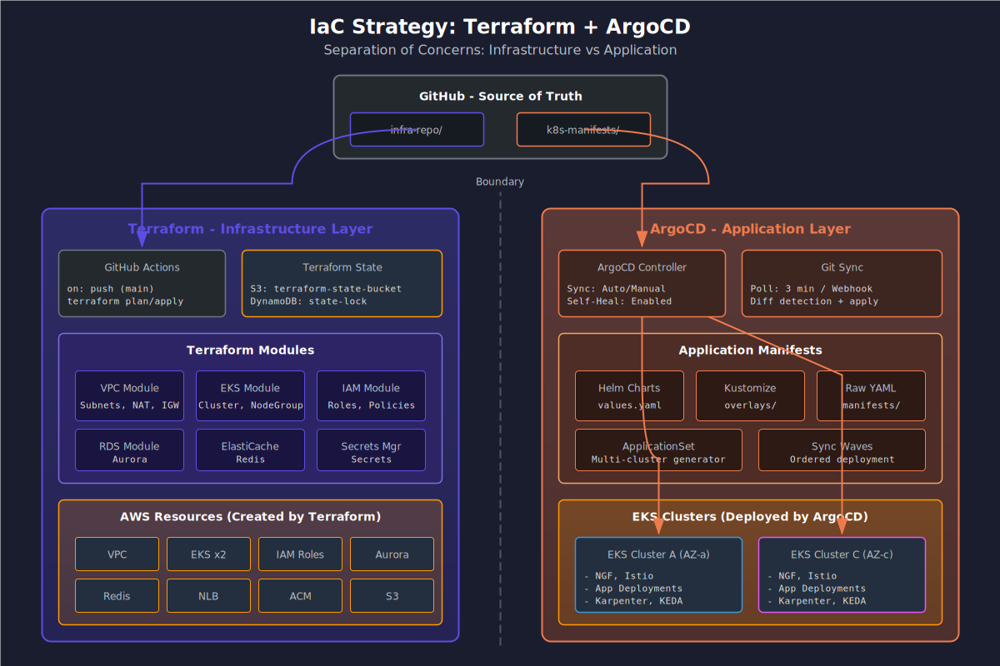

# ECS → EKS Migration Deep Dive
GitOps & Progressive Delivery

@type: cover
@background: ../common/pptx-theme/images/Picture_13.png
@badge: ../common/pptx-theme/images/Picture_8.png

:::notes
{timing: 1min}
Block 02에서는 GitOps와 Progressive Delivery에 대해 다룹니다. ArgoCD를 활용한 선언적 배포와 Argo Rollouts + Istio를 통한 안전한 Canary 배포 전략을 살펴보겠습니다.
:::

---

@type: content

## CI/CD Pain Point

> "CI/CD 파이프라인과 EKS 배포 연동이 미흡하고, 배포 실패 시 롤백이 수동으로 진행됩니다."

::: left
### 현재 문제점
- Jenkins/CodePipeline 기반 Push 모델
- 배포 상태 추적 어려움
- 롤백 시 수동 개입 필요
- 환경별 설정 일관성 부족
:::

::: right
### GitOps 도입 효과
- Git = Single Source of Truth
- 자동화된 Drift Detection
- 메트릭 기반 자동 롤백
- 환경별 설정 코드화
:::

:::notes
{timing: 2min}
{cue: pause}
현재 Push 기반 배포의 문제점입니다. 배포 파이프라인이 클러스터에 직접 kubectl apply를 실행하는 방식은 배포 상태 추적이 어렵고, 실패 시 롤백도 수동입니다. GitOps는 이 문제를 Pull 모델로 해결합니다.
:::

---

@type: content

## IaC 전략: Terraform + ArgoCD



:::notes
{timing: 3min}
인프라와 애플리케이션 배포를 분리하는 전략입니다. Terraform은 EKS 클러스터, VPC, IAM 등 인프라를 관리하고, ArgoCD는 Kubernetes 워크로드를 관리합니다. 이 분리를 통해 인프라 변경과 애플리케이션 배포의 책임을 명확히 구분합니다.
:::

---

@type: tabs

## Terraform vs ArgoCD vs ACK 의사결정

### 의사결정 매트릭스
| 리소스 특성 | Terraform | ArgoCD | ACK |
|------------|-----------|--------|-----|
| EKS 클러스터, VPC, Subnet | **✅ 권장** | ❌ | ❌ |
| EKS Add-on (VPC CNI, CoreDNS) | **✅ 권장** | △ 가능 | △ 가능 |
| K8s Controller (ALB, ExternalDNS) | △ 가능 | **✅ 권장** | ❌ |
| 앱 Deployment, Service | ❌ | **✅ 권장** | ❌ |
| 앱 전용 S3 Bucket | △ 가능 | △ 가능 | **✅ 권장** |
| 앱 전용 SQS Queue | △ 가능 | △ 가능 | **✅ 권장** |
| 앱 전용 IAM Role | **✅ 권장** | ❌ | △ 가능 |
| 공용 RDS/Aurora | **✅ 권장** | ❌ | △ 가능 |
| 공용 ElastiCache | **✅ 권장** | ❌ | △ 가능 |

**핵심 원칙**: 리소스의 생명주기가 앱과 같으면 → ACK/ArgoCD, 인프라 수준이면 → Terraform

### ACK 개요
**AWS Controllers for Kubernetes (ACK)**
- Kubernetes CR로 AWS 리소스를 선언적 관리
- `kubectl apply`로 S3, SQS, RDS 등 생성/삭제
- ArgoCD와 자연스럽게 통합 (GitOps)

```yaml
# ACK로 SQS Queue 생성
apiVersion: sqs.services.k8s.aws/v1alpha1
kind: Queue
metadata:
  name: order-queue
  namespace: production
spec:
  queueName: hwahae-order-queue
  visibilityTimeout: "30"
  tags:
    - key: team
      value: backend
```

**장점**: 앱과 AWS 리소스를 동일한 GitOps 워크플로우로 관리
**제한**: IAM, VPC 등 인프라 리소스는 지원 제한적

### ACK vs Terraform 선택 기준
```
앱 전용 AWS 리소스인가?
  ├─ Yes → 리소스 생명주기가 앱과 동일한가?
  │         ├─ Yes → ACK (GitOps 통합)
  │         └─ No  → Terraform
  └─ No (공용 리소스) → Terraform

보안 민감 리소스인가? (IAM Role, SG)
  ├─ Yes → Terraform (변경 이력 + Plan 검증)
  └─ No  → ACK 또는 Terraform
```

**화해 현재 구조와 매핑**:
- `terraform/`: EKS, VPC, 공용 RDS, IAM → 유지
- `terraform/applications/<app>/`: 앱 전용 SG, IAM → 유지 (보안상 Terraform 권장)
- **신규**: 앱 전용 S3, SQS, SNS → ACK로 전환 검토

### EKS Capabilities 의사결정
**EKS Capabilities** (관리형 Add-on, Auto Mode 등)

| 항목 | EKS Add-on (Terraform) | ArgoCD | 판단 기준 |
|------|----------------------|--------|----------|
| VPC CNI | **✅** | △ | EKS API 통합, 자동 업그레이드 |
| CoreDNS | **✅** | △ | EKS 버전 호환성 자동 관리 |
| kube-proxy | **✅** | △ | EKS 버전 연동 |
| AWS LB Controller | △ | **✅** | Helm values 커스터마이징 필요 |
| External DNS | ❌ | **✅** | K8s 네이티브 설정 |
| Cert Manager | ❌ | **✅** | K8s 네이티브 설정 |
| Karpenter | △ | **✅** | NodePool CRD는 ArgoCD가 적합 |
| ADOT/CloudWatch Agent | **✅** | △ | EKS Add-on으로 간편 관리 |

**원칙**: EKS API로 관리되는 핵심 네트워킹/시스템 컴포넌트는 Terraform, 나머지 Controller는 ArgoCD

:::notes
{timing: 3min}
Terraform, ArgoCD, ACK의 역할 분담 의사결정 가이드입니다. 핵심은 리소스의 생명주기입니다. 앱과 함께 생성/삭제되는 리소스는 ACK로 GitOps 통합하고, 인프라 수준의 장기 리소스는 Terraform으로 관리합니다. 화해의 현재 Terraform + ArgoCD 구조는 잘 설계되어 있으며, 여기에 ACK를 추가하면 앱 전용 S3, SQS 등을 더 효율적으로 관리할 수 있습니다. EKS Capabilities 중 VPC CNI, CoreDNS 등은 EKS Add-on으로, ALB Controller, Karpenter 등은 ArgoCD로 관리하는 것이 적합합니다.
:::

---

@type: code

## ACK 실전 설정

```yaml {filename="ack-setup.yaml" highlight="7-8,22-27,35-40"}
# 1. ACK S3 Controller 설치 (ArgoCD Application)
apiVersion: argoproj.io/v1alpha1
kind: Application
metadata:
  name: ack-s3-controller
  namespace: argocd
spec:
  source:
    chart: s3-chart
    repoURL: public.ecr.aws/aws-controllers-k8s
    targetRevision: v1.0.15
    helm:
      values: |
        serviceAccount:
          annotations:
            eks.amazonaws.com/role-arn: arn:aws:iam::123456789012:role/ACK-S3-Role
  destination:
    server: https://kubernetes.default.svc
    namespace: ack-system
# ---
# 2. 앱 전용 S3 Bucket (앱 매니페스트와 함께 배포)
apiVersion: s3.services.k8s.aws/v1alpha1
kind: Bucket
metadata:
  name: hwahae-user-uploads
  namespace: production
spec:
  name: hwahae-user-uploads-prod
  versioning:
    status: Enabled
  encryption:
    rules:
      - applyServerSideEncryptionByDefault:
          sseAlgorithm: aws:kms
# ---
# 3. 앱 전용 SQS Queue
apiVersion: sqs.services.k8s.aws/v1alpha1
kind: Queue
metadata:
  name: order-processing
  namespace: production
spec:
  queueName: hwahae-order-processing
  visibilityTimeout: "60"
  messageRetentionPeriod: "345600"
  redrivePolicy: |
    {
      "deadLetterTargetArn": "arn:aws:sqs:ap-northeast-2:123456789012:hwahae-order-dlq",
      "maxReceiveCount": 3
    }
```

:::notes
{timing: 2min}
ACK 실전 설정 예시입니다. ACK Controller는 ArgoCD Application으로 설치하고, IRSA로 AWS 권한을 부여합니다. 앱 전용 S3 Bucket과 SQS Queue를 Kubernetes CR로 정의하면, ArgoCD가 앱 배포와 함께 AWS 리소스도 자동으로 생성합니다. 이렇게 하면 앱과 인프라가 동일한 Git 저장소에서 관리되어 라이프사이클이 일치합니다.
:::

---

@type: compare

## ArgoCD Sync vs Argo Rollouts

::: left
### ArgoCD Sync (일반 배포)
- Git 변경 감지 → 자동/수동 Sync
- Deployment의 기본 RollingUpdate 사용
- **장점**: 설정 간단, 빠른 배포
- **단점**: 세밀한 트래픽 제어 불가
- **적합**: 내부 서비스, 개발 환경

```yaml
syncPolicy:
  automated:
    prune: true
    selfHeal: true
```
:::

::: right
### Argo Rollouts (Progressive Delivery)
- Canary / Blue-Green 배포 지원
- 트래픽 가중치 단계별 조정
- **장점**: 메트릭 기반 자동 롤백
- **장점**: Istio VirtualService 연동
- **적합**: 프로덕션, 고객 대면 서비스

```yaml
strategy:
  canary:
    steps:
      - setWeight: 10
      - analysis: {templates: [success-rate]}
      - setWeight: 50
```
:::

:::notes
{timing: 2min}
ArgoCD의 기본 Sync와 Argo Rollouts의 차이입니다. 일반 배포는 Kubernetes의 RollingUpdate를 사용하고, Rollouts는 트래픽 가중치를 단계별로 조정하며 메트릭 분석을 통해 자동 롤백할 수 있습니다.
:::

---

@type: canvas
@canvas-id: argo-rollouts-canary

## Argo Rollouts + Istio Canary

:::canvas
# Step 1: 서비스 구성요소 표시
icon rollout "Argo-Rollouts" at 100,80 size 48 step 1
box stable "Stable Pods (v1)" at 300,50 size 140,50 color #00C7B7 step 1
box canary "Canary Pods (v2)" at 300,130 size 140,50 color #FF9900 step 1

# Step 2: Istio VirtualService
icon istio "Istio" at 100,180 size 48 step 2
box vs "VirtualService" at 220,170 size 120,40 color #326CE5 step 2
box dr "DestinationRule" at 380,170 size 120,40 color #326CE5 step 2

# Step 3: 트래픽 가중치 표시
arrow vs -> stable "90%" color #00C7B7 step 3
arrow vs -> canary "10%" color #FF9900 step 3

# Step 4: Analysis 연동
icon prometheus "Prometheus" at 550,80 size 48 step 4
box analysis "AnalysisRun" at 520,150 size 100,40 color #FFA726 step 4
arrow canary -> prometheus "metrics" style dashed step 4
arrow analysis -> rollout "pass/fail" style dashed step 4

# Step 5: Promote 또는 Rollback
box promote "Promote → 100%" at 100,280 size 120,40 color #4CAF50 step 5
box rollback "Rollback → 0%" at 280,280 size 120,40 color #f44336 step 5
:::

:::notes
{timing: 3min}
Argo Rollouts와 Istio 통합 아키텍처입니다. Rollouts 컨트롤러가 VirtualService의 가중치를 자동으로 조정하고, AnalysisRun이 Prometheus 메트릭을 조회하여 성공/실패를 판단합니다. 성공률이 임계값 미만이면 자동으로 롤백됩니다.

GitBook 참고: https://atomoh.gitbook.io/kubernetes-docs/service-mesh/istio/advanced/08-argo-rollouts
:::

---

@type: code

## Rollout 설정

```yaml {filename="rollout.yaml" highlight="12-17,19-28,30-39"}
apiVersion: argoproj.io/v1alpha1
kind: Rollout
metadata:
  name: hwahae-api
  namespace: production
spec:
  replicas: 5
  selector:
    matchLabels:
      app: hwahae-api
  template:
    metadata:
      labels:
        app: hwahae-api
    spec:
      containers:
        - name: api
          image: hwahae/api:v2.0.0
          ports:
            - containerPort: 8080
  strategy:
    canary:
      # Stable/Canary Service
      canaryService: hwahae-api-canary
      stableService: hwahae-api-stable
      # Istio 트래픽 라우팅
      trafficRouting:
        istio:
          virtualService:
            name: hwahae-api
            routes:
              - primary
          destinationRule:
            name: hwahae-api
            canarySubsetName: canary
            stableSubsetName: stable
      # 배포 단계
      steps:
        - setWeight: 10
        - pause: {duration: 2m}
        - analysis:
            templates:
              - templateName: success-rate
        - setWeight: 30
        - pause: {duration: 2m}
        - setWeight: 50
        - pause: {duration: 5m}
        - setWeight: 80
        - pause: {duration: 5m}
# ---
apiVersion: argoproj.io/v1alpha1
kind: AnalysisTemplate
metadata:
  name: success-rate
spec:
  metrics:
    - name: success-rate
      interval: 30s
      count: 5
      successCondition: result >= 0.95
      failureLimit: 2
      provider:
        prometheus:
          address: http://prometheus.istio-system:9090
          query: |
            sum(rate(istio_requests_total{
              destination_service_name="hwahae-api",
              response_code!~"5.*"
            }[2m])) /
            sum(rate(istio_requests_total{
              destination_service_name="hwahae-api"
            }[2m]))
```

:::notes
{timing: 2min}
Rollout과 AnalysisTemplate 설정 예시입니다. Canary 배포는 10% → 30% → 50% → 80% → 100%로 진행되며, 각 단계에서 Analysis를 실행합니다. 성공률이 95% 미만이면 2회 실패 후 자동 롤백됩니다.
:::

---

@type: timeline

## Canary Deployment Flow

1. **10%** — 초기 트래픽 전환, 2분 대기 후 메트릭 분석
2. **30%** — 성공 시 트래픽 증가, 에러율 모니터링
3. **50%** — 절반 전환, 5분간 안정성 검증
4. **80%** — 대부분 전환, 최종 검증
5. **100%** — 완전 전환, Stable로 Promote

:::notes
{timing: 2min}
Canary 배포의 각 단계입니다. 작은 트래픽부터 시작하여 점진적으로 증가시키며, 각 단계에서 메트릭을 분석합니다. 문제 발생 시 즉시 롤백하여 사용자 영향을 최소화합니다.
:::

---

@type: canvas
@canvas-id: zone-aware-rollouts

## Zone-Aware Rollouts

:::canvas
# Step 1: Zone별 클러스터 표시
box zoneA "Zone A Cluster" at 50,50 size 200,180 color #232F3E step 1
box zoneC "Zone C Cluster" at 300,50 size 200,180 color #232F3E step 1

# Step 2: Zone별 Rollout
box rolloutA "Rollout A" at 80,80 size 80,30 color #E6522C step 2
box stableA "Stable" at 70,120 size 60,25 color #00C7B7 step 2
box canaryA "Canary" at 140,120 size 60,25 color #FF9900 step 2

box rolloutC "Rollout C" at 330,80 size 80,30 color #E6522C step 2
box stableC "Stable" at 320,120 size 60,25 color #00C7B7 step 2
box canaryC "Canary" at 390,120 size 60,25 color #FF9900 step 2

# Step 3: 독립적 PDB
box pdbA "PDB: minAvailable=2" at 70,160 size 140,25 color #9C27B0 step 3
box pdbC "PDB: minAvailable=2" at 320,160 size 140,25 color #9C27B0 step 3

# Step 4: Locality Failover
icon nlb "NLB" at 250,270 size 48 step 4
arrow nlb -> zoneA "50%" step 4
arrow nlb -> zoneC "50%" step 4
box failover "Zone 장애 시 자동 Failover" at 180,320 size 200,30 color #f44336 step 4
:::

:::notes
{timing: 3min}
Zone-Aware Rollouts 아키텍처입니다. 각 Zone의 Rollout이 독립적인 PDB를 관리하여, 한 Zone의 Spot Instance 중단이 다른 Zone에 영향을 주지 않습니다. Istio의 locality-aware 라우팅으로 Zone 장애 시 자동 Failover됩니다.

GitBook 참고: https://atomoh.gitbook.io/kubernetes-docs/service-mesh/istio/advanced/09-zone-aware-argo-rollouts
:::

---

@type: tabs

## GitHub Self-Hosted Runner (ARC)

### ARC 개요
**Actions Runner Controller (ARC)**
- GitHub Actions Self-Hosted Runner를 EKS에서 실행
- Runner Pod 자동 스케일링 (HRA)
- 워크로드별 Runner 격리 가능

**장점**:
- VPC 내부 리소스 접근 (RDS, ElastiCache)
- ECR Push 시 IAM Role 활용
- 빌드 캐시 PVC로 속도 향상

### 아키텍처
```
GitHub Actions Workflow
        ↓
  Webhook Event (workflow_job)
        ↓
  ARC Controller (EKS)
        ↓
  Runner Pod 생성 (ephemeral)
        ↓
  Job 실행 → ECR Push → ArgoCD Sync
        ↓
  Runner Pod 삭제
```

### 리소스 설정
```yaml
# Runner Pod 리소스
resources:
  requests:
    cpu: "500m"
    memory: "1Gi"
  limits:
    cpu: "2000m"
    memory: "4Gi"

# Runner 스케일링
minRunners: 1
maxRunners: 10
```

:::notes
{timing: 2min}
GitHub Actions Runner Controller(ARC)를 EKS에서 운영하는 방법입니다. Self-Hosted Runner를 사용하면 VPC 내부 리소스에 접근할 수 있고, IRSA를 통해 안전하게 ECR에 이미지를 Push할 수 있습니다.
:::

---

@type: code

## ARC 설정

```yaml {filename="arc-config.yaml" highlight="6-8,17-23,30-35"}
# 1. RunnerDeployment - Runner Pool 정의
apiVersion: actions.summerwind.dev/v1alpha1
kind: RunnerDeployment
metadata:
  name: hwahae-runners
  namespace: arc-runners
spec:
  replicas: 2
  template:
    spec:
      repository: hwahae/backend
      labels:
        - self-hosted
        - linux
        - eks
      serviceAccountName: arc-runner
      resources:
        requests:
          cpu: "500m"
          memory: "1Gi"
        limits:
          cpu: "2000m"
          memory: "4Gi"
      # Docker-in-Docker 설정
      dockerEnabled: true
      dockerMTU: 1400
# ---
# 2. HorizontalRunnerAutoscaler - 자동 스케일링
apiVersion: actions.summerwind.dev/v1alpha1
kind: HorizontalRunnerAutoscaler
metadata:
  name: hwahae-runners-autoscaler
  namespace: arc-runners
spec:
  scaleTargetRef:
    kind: RunnerDeployment
    name: hwahae-runners
  minReplicas: 1
  maxReplicas: 10
  metrics:
    - type: TotalNumberOfQueuedAndInProgressWorkflowRuns
      repositoryNames:
        - hwahae/backend
        - hwahae/frontend
# ---
# 3. ServiceAccount with IRSA
apiVersion: v1
kind: ServiceAccount
metadata:
  name: arc-runner
  namespace: arc-runners
  annotations:
    eks.amazonaws.com/role-arn: arn:aws:iam::123456789012:role/ARC-Runner-Role
```

:::notes
{timing: 2min}
ARC 설정 예시입니다. RunnerDeployment로 Runner Pool을 정의하고, HorizontalRunnerAutoscaler로 대기 중인 Job 수에 따라 자동 스케일링합니다. IRSA를 통해 Runner Pod가 ECR, S3 등 AWS 리소스에 접근할 수 있습니다.
:::

---

@type: compare

## NGINX Gateway Fabric vs Istio Gateway

::: left
### NGINX Gateway Fabric
**역할**: North-South 트래픽 (외부 → 클러스터)

- L4/L7 로드밸런싱
- TLS 종료
- Rate Limiting
- WAF 통합 가능
- **Gateway API 네이티브**

```yaml
apiVersion: gateway.networking.k8s.io/v1
kind: Gateway
metadata:
  name: external-gateway
spec:
  gatewayClassName: nginx
  listeners:
    - name: https
      port: 443
      protocol: HTTPS
```
:::

::: right
### Istio Gateway
**역할**: East-West 트래픽 (Pod ↔ Pod)

- Service Mesh (mTLS)
- 트래픽 미러링
- Circuit Breaker
- Canary 배포 (Argo Rollouts 연동)
- **VirtualService/DestinationRule**

```yaml
apiVersion: networking.istio.io/v1
kind: VirtualService
metadata:
  name: internal-routing
spec:
  hosts:
    - api-service
  http:
    - route:
        - destination:
            host: api-service
            subset: stable
          weight: 90
```
:::

:::notes
{timing: 2min}
{cue: question}
NGF와 Istio의 역할 분담입니다. 둘 다 사용할 필요가 있는지 질문을 많이 받는데요, 외부 트래픽 관리(NGF)와 내부 서비스 메시(Istio)는 다른 문제를 해결합니다. 화해처럼 Canary 배포가 필요한 경우 Istio가 필수입니다.
:::

---

@type: checklist

## GitOps Best Practices

- [ ] **Repository 구조**
  - 모노레포 vs 폴리레포 결정
  - `base/` + `overlays/` Kustomize 구조
  - 환경별 브랜치 또는 디렉토리 분리

- [ ] **Sync 전략**
  - Dev/Staging: `automated` + `selfHeal: true`
  - Production: `manual` 또는 Sync Window 설정
  - `prune: true` 신중하게 적용

- [ ] **보안**
  - Sealed Secrets 또는 External Secrets Operator
  - RBAC: AppProject별 네임스페이스 제한
  - SSO 통합 (OIDC)

- [ ] **운영**
  - Notification 설정 (Slack, PagerDuty)
  - Application 상태 대시보드 구성
  - 정기적 Diff 리포트 검토

:::notes
{timing: 2min}
GitOps 도입 시 베스트 프랙티스입니다. 특히 프로덕션에서는 자동 동기화를 신중하게 설정해야 합니다. Sync Window를 활용하여 업무 시간 외에만 자동 배포가 되도록 제한하는 것을 권장합니다.

GitBook 참고: https://atomoh.gitbook.io/kubernetes-docs/gitops/argocd/09-best-practices
:::

---

@type: quiz

## Block 02 Quiz

**Q1: GitOps의 핵심 원칙은?**
- [ ] CI 파이프라인이 직접 kubectl apply 실행
- [x] Git이 Single Source of Truth
- [ ] 수동 배포로 변경 통제
- [ ] 환경별 설정을 별도 DB에 저장

**Q2: Argo Rollouts에서 Canary 배포 실패 시 동작은?**
- [ ] 수동으로 kubectl rollback 실행
- [ ] 배포가 그대로 유지됨
- [x] AnalysisRun 실패 시 자동 롤백
- [ ] 알림만 발송하고 대기

**Q3: Zone-Aware Rollouts의 주요 장점은?**
- [ ] 배포 속도가 빨라진다
- [x] Zone별 독립적 PDB로 Spot 중단 대응
- [ ] 단일 Rollout으로 모든 Zone 관리
- [ ] Istio 없이 Canary 배포 가능

**Q4: ArgoCD에서 프로덕션 환경 권장 Sync 정책은?**
- [ ] automated + selfHeal: true
- [x] manual 또는 Sync Window 설정
- [ ] prune: true + allowEmpty: true
- [ ] 자동 동기화 + 3분 간격

:::notes
{timing: 3min}
{cue: question}
Block 02 퀴즈입니다. GitOps와 Progressive Delivery의 핵심 개념을 확인합니다. 특히 프로덕션 환경에서의 안전한 배포 전략에 대해 복습해보세요.
:::
